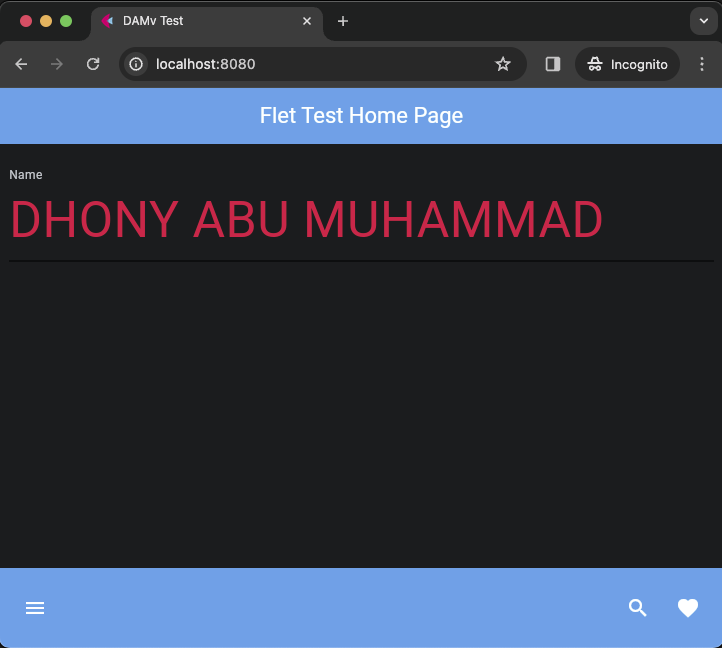

# Python : flet app textfield bottom_appbar fly.io deploy damvflettextfield

files structure :

    ❯ tree -L 2 -I 'gambar-petunjuk|README.md'

        ├── Dockerfile
        ├── main.py
        └── requirements.txt

#### code :

- python

    ❯ vim main.py

        import flet as ft

        def main(page: ft.Page):
            page.title = "DAMv Test" 

            page.appbar = ft.AppBar(
                title=ft.Text("Flet Test Home Page", color=ft.colors.WHITE),  
                bgcolor=ft.colors.BLUE,  
                center_title=True  
            )

            text_field_name = ft.TextField(value="", 
                                    label="Name",
                                    hint_text="Enter text here", 
                                    text_size=50,
                                    color=ft.colors.RED,
                                    border_color=ft.colors.BLUE_200, 
                                    capitalization="characters",
                                    border=ft.InputBorder.UNDERLINE)

            page.bottom_appbar = ft.BottomAppBar(
                bgcolor=ft.colors.BLUE,
                content=ft.Row(
                    controls=[
                        ft.IconButton(icon=ft.icons.MENU, icon_color=ft.colors.WHITE),
                        ft.Container(expand=True),
                        ft.IconButton(icon=ft.icons.SEARCH, icon_color=ft.colors.WHITE),
                        ft.IconButton(icon=ft.icons.FAVORITE, icon_color=ft.colors.WHITE),
                    ]
                ),
            )

            page.add(text_field_name)

        ft.app(target=main,port=8080, view=None)

- Dockerfile

        ❯ vim Dockerfile

            FROM python:3-alpine

            WORKDIR /app

            COPY requirements.txt ./
            RUN pip install --no-cache-dir -r requirements.txt

            COPY . .

            EXPOSE 8080

            CMD ["python", "./main.py"]

#### Test application with Docker container

    ❯ docker build -t fletapp .

    ❯ docker run -d --name fletapp-avc -p 8080:8080 fletapp

    # list

    ❯ docker images

        REPOSITORY   TAG       IMAGE ID       CREATED         SIZE
        fletapp      latest    04b55dd3acb2   7 seconds ago   143MB

    ❯ docker ps -a --format "table {{.ID}}\t{{.Image}}\t{{.Status}}\t{{.Names}}\t{{.Ports}}"

        CONTAINER ID   IMAGE     STATUS         NAMES         PORTS
        b1f9de1944fb   fletapp   Up 6 seconds   fletapp-avc   0.0.0.0:8080->8080/tcp

#### Result :

    

#### Reset containers :

---

    

---

## Stages in deploying the application to fly.io

#### code :

- toml [Tom's Obvious Minimal Language]

#### check version :

### &#x1F530; create Apps :

check and watch for updates on the fly.io console dashboard (https://fly.io/dashboard)

### &#x1F530; deploy Apps :

check and watch for updates on the fly.io console dashboard (https://fly.io/dashboard)

### &#x1F530; check

### &#x1F530; open :

---

    

---

### delete apps