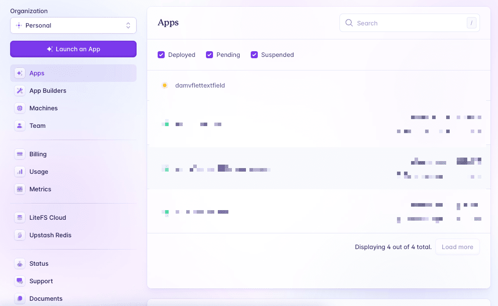
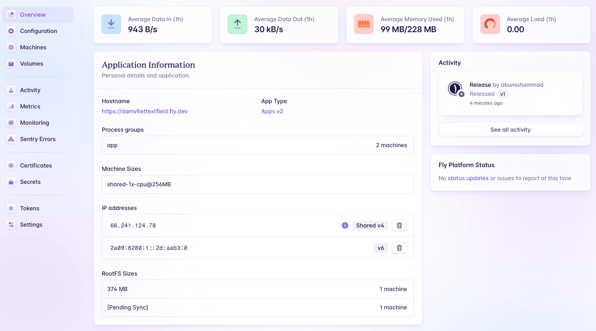
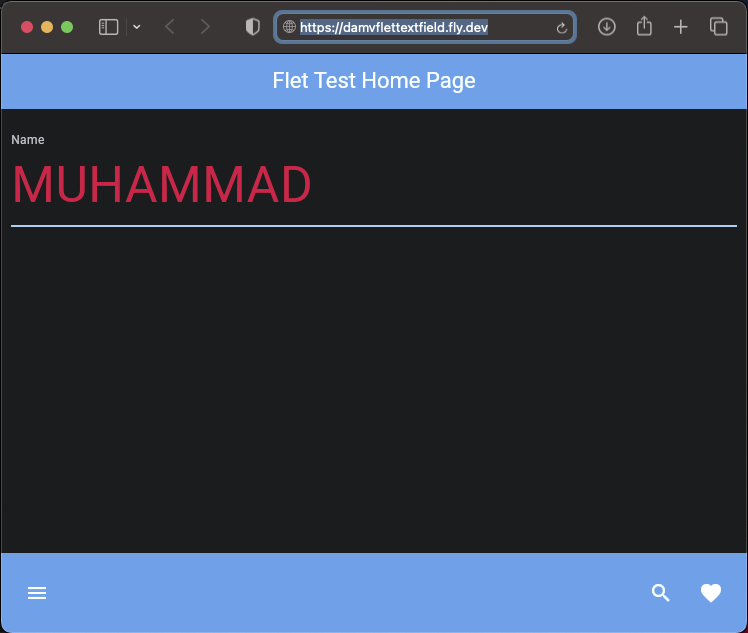
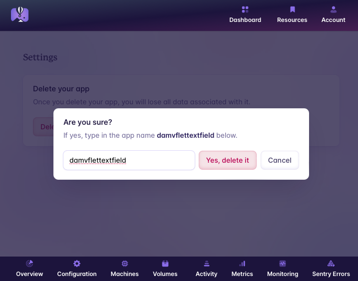

# Python : flet app textfield bottom_appbar fly.io deploy damvflettextfield

files structure :

    ❯ tree -L 2 -I 'gambar-petunjuk|README.md'

        ├── Dockerfile
        ├── main.py
        └── requirements.txt

#### code :

- python

    ❯ vim main.py

        import flet as ft

        def main(page: ft.Page):
            page.title = "DAMv Test" 

            page.appbar = ft.AppBar(
                title=ft.Text("Flet Test Home Page", color=ft.colors.WHITE),  
                bgcolor=ft.colors.BLUE,  
                center_title=True  
            )

            text_field_name = ft.TextField(value="", 
                                    label="Name",
                                    hint_text="Enter text here", 
                                    text_size=50,
                                    color=ft.colors.RED,
                                    border_color=ft.colors.BLUE_200, 
                                    capitalization="characters",
                                    border=ft.InputBorder.UNDERLINE)

            page.bottom_appbar = ft.BottomAppBar(
                bgcolor=ft.colors.BLUE,
                content=ft.Row(
                    controls=[
                        ft.IconButton(icon=ft.icons.MENU, icon_color=ft.colors.WHITE),
                        ft.Container(expand=True),
                        ft.IconButton(icon=ft.icons.SEARCH, icon_color=ft.colors.WHITE),
                        ft.IconButton(icon=ft.icons.FAVORITE, icon_color=ft.colors.WHITE),
                    ]
                ),
            )

            page.add(text_field_name)

        ft.app(target=main,port=8080, view=None)

- Dockerfile

        ❯ vim Dockerfile

            FROM python:3-alpine

            WORKDIR /app

            COPY requirements.txt ./
            RUN pip install --no-cache-dir -r requirements.txt

            COPY . .

            EXPOSE 8080

            CMD ["python", "./main.py"]

#### Test application with Docker container

    ❯ docker build -t fletapp .

    ❯ docker run -d --name fletapp-avc -p 8080:8080 fletapp

    # list

    ❯ docker images

        REPOSITORY   TAG       IMAGE ID       CREATED         SIZE
        fletapp      latest    04b55dd3acb2   7 seconds ago   143MB

    ❯ docker ps -a --format "table {{.ID}}\t{{.Image}}\t{{.Status}}\t{{.Names}}\t{{.Ports}}"

        CONTAINER ID   IMAGE     STATUS         NAMES         PORTS
        b1f9de1944fb   fletapp   Up 6 seconds   fletapp-avc   0.0.0.0:8080->8080/tcp

#### Result :

    

#### Reset containers :

    ❯ docker rm -f $(docker ps -aq) && docker rmi -f $(docker images -q)

        b1f9de1944fb
        Untagged: fletapp:latest
        Deleted: sha256:04b55dd3acb2588f5f6f0620e8a8730c1f139d397ae197b553d3934644811084

---

    

---

## Stages in deploying the application to fly.io

#### code :

- toml [Tom's Obvious Minimal Language]

        ❯ vim fly.toml

            app = "damvflettextfield"

            kill_signal = "SIGINT"
            kill_timeout = 5
            processes = []

            [env]
            FLET_SERVER_PORT = "8080"

            [experimental]
            allowed_public_ports = []
            auto_rollback = true

            [[services]]
            http_checks = []
            internal_port = 8080
            processes = ["app"]
            protocol = "tcp"
            script_checks = []

            [services.concurrency]
                hard_limit = 25
                soft_limit = 20
                type = "connections"

            [[services.ports]]
                force_https = true
                handlers = ["http"]
                port = 80

            [[services.ports]]
                handlers = ["tls", "http"]
                port = 443

            [[services.tcp_checks]]
                grace_period = "1s"
                interval = "15s"
                restart_limit = 0
                timeout = "2s"

#### check version :

    ❯ flyctl version

        flyctl v0.2.15 darwin/arm64 Commit: 846630217aff135b32ec0d6a018cf6bdde0f1762 BuildDate: 2024-03-10T09:52:28Z

### &#x1F530; create Apps :

    ❯ flyctl apps create --name damvflettextfield

        automatically selected personal organization: abumuhammad
        New app created: damvflettextfield

check and watch for updates on the fly.io console dashboard (https://fly.io/dashboard)

    

### &#x1F530; deploy Apps :

    ❯ flyctl deploy

        ==> Verifying app config
        Validating /Users/.../python-flet-app-textfield-bottom_appbar-fly.io-deploy-damvflettextfield/fly.toml
        ✓ Configuration is valid
        --> Verified app config
        ==> Building image
        Remote builder fly-builder-throbbing-shadow-8193 ready
        Remote builder fly-builder-throbbing-shadow-8193 ready
        ==> Building image with Docker
        --> docker host: 20.10.12 linux x86_64
        [+] Building 3.9s (10/10) FINISHED                                                                                                         
        => [internal] load build definition from Dockerfile                                                                                  0.1s
        => => transferring dockerfile: 202B                                                                                                  0.1s
        => [internal] load .dockerignore                                                                                                     0.1s
        => => transferring context: 2B                                                                                                       0.1s
        => [internal] load metadata for docker.io/library/python:3-alpine                                                                    0.6s
        => [internal] load build context                                                                                                     3.1s
        => => transferring context: 500.28kB                                                                                                 3.0s
        => [1/5] FROM docker.io/library/python:3-alpine@sha256:1a0501213b470de000d8432b3caab9d8de5489e9443c2cc7ccaa6b0aa5c3148e              0.0s
        => CACHED [2/5] WORKDIR /app                                                                                                         0.0s
        => CACHED [3/5] COPY requirements.txt ./                                                                                             0.0s
        => CACHED [4/5] RUN pip install --no-cache-dir -r requirements.txt                                                                   0.0s
        => [5/5] COPY . .                                                                                                                    0.0s
        => exporting to image                                                                                                                0.0s
        => => exporting layers                                                                                                               0.0s
        => => writing image sha256:018d171f5bb29dea5a5dc4fb102817fcad88466604e75bfe319235b62860d08c                                          0.0s
        => => naming to registry.fly.io/damvflettextfield:deployment-01HRS0HZ65DFP19AB2DDJ9APH9                                              0.0s
        --> Building image done
        ==> Pushing image to fly
        The push refers to repository [registry.fly.io/damvflettextfield]
        33d26b4eaad3: Pushed 
        3b6a513fc8ed: Pushed 
        04290844c800: Pushed 
        eaaac683c25a: Pushed 
        5305019f4685: Pushed 
        d2968c01735e: Pushed 
        0c9bfb14c909: Pushed 
        678cac8b069e: Pushed 
        d4fc045c9e3a: Pushed 
        deployment-01HRS0HZ65DFP19AB2DDJ9APH9: digest: sha256:be4426b49ab249e18df56627700c4dd5488fce4280b01141684e7d9df6ead7ae size: 2203
        --> Pushing image done
        image: registry.fly.io/damvflettextfield:deployment-01HRS0HZ65DFP19AB2DDJ9APH9
        image size: 139 MB

        Watch your deployment at https://fly.io/apps/damvflettextfield/monitoring

        Provisioning ips for damvflettextfield
        Dedicated ipv6: 2a09:8280:1::2d:aab3:0
        Shared ipv4: 66.241.124.70
        Add a dedicated ipv4 with: fly ips allocate-v4

        This deployment will:
        * create 2 "app" machines

        No machines in group app, launching a new machine
        Creating a second machine to increase service availability
        Finished launching new machines
        -------
        ✔ Machine 3d8d9566b65738 [app] update finished: success
        -------
        Checking DNS configuration for damvflettextfield.fly.dev

        Visit your newly deployed app at https://damvflettextfield.fly.dev/

check and watch for updates on the fly.io console dashboard (https://fly.io/dashboard)

    

### &#x1F530; check

    ❯ flyctl status

        App
        Name     = damvflettextfield                                        
        Owner    = personal                                                 
        Hostname = damvflettextfield.fly.dev                                
        Image    = damvflettextfield:deployment-01HRS0HZ65DFP19AB2DDJ9APH9  

        Machines
        PROCESS ID              VERSION REGION  STATE   ROLE    CHECKS                  LAST UPDATED         
        app     3d8d9566b65738  1       sin     started         1 total, 1 passing      2024-03-12T09:42:02Z
        app     568346df21598e  1       sin     started         1 total, 1 passing      2024-03-12T09:41:45Z

    ❯ flyctl ips list

        VERSION IP                      TYPE                    REGION  CREATED AT       
        v6      2a09:8280:1::2d:aab3:0  public (dedicated)      global  8m24s ago       
        v4      66.241.124.70           public (shared)                 Jan 1 0001 00:00

        Learn more about Fly.io public, private, shared and dedicated IP addresses in our docs: https://fly.io/docs/reference/services/#ip-addresses

    ❯ flyctl services list

        Services
        PROTOCOL        PORTS           HANDLERS        FORCE HTTPS     PROCESS GROUP   REGIONS MACHINES 
        TCP             80 => 8080      [HTTP]          True            app             sin     2       
        TCP             443 => 8080     [TLS,HTTP]      False           app             sin     2 

### &#x1F530; open :

    ❯ flyctl open

        Command "open" is deprecated, use `fly apps open` instead
        opening https://damvflettextfield.fly.dev/ ...

    

---

    

---

### delete apps

    

